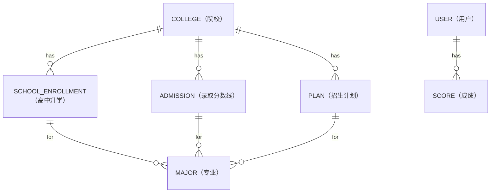

## 数据字典

### E-R 图



### 系统基础数据类

#### 院校信息

由两个表进行维护

+ 院校信息表：这个表只用于存放院校的基本信息，如院校名称、院校编码、所在省份及城市、院校等级、基础介绍等

| 字段名 | 数据类型 | 可为空 | 主键 | 说明 |
|--------|---------|------|------|--------|
| COLLEGE_CODE | INT | 否 | 是 | 院校编码（如：10001） |
| COLLEGE_NAME | VARCHAR(255) | 否 | 否 | 院校名称 |
| IS_985 | TINYINT(1) | 否 | 否 | 是否 985（0/1，仅允许 0/1） |
| IS_211 | TINYINT(1) | 否 | 否 | 是否 211（0/1，仅允许 0/1） |
| IS_DFC | TINYINT(1) | 否 | 否 | 是否双一流（0/1，仅允许 0/1） |
| PROVINCE | VARCHAR(48) | 否 | 否 | 所在省份 |
| CITY_NAME | VARCHAR(50) | 是 | 否 | 所在城市 |
| BASE_INTRO | TEXT | 是 | 否 | 院校基础介绍 |

+ 历年录取分数线表：维护各院校各专业历年的录取分数数据，是成绩匹配和差距分析的关键参考数据。

| 字段名 | 数据类型 | 可为空 | 主键 | 说明 |
|--------|---------|------|------|--------|
| ADMISSION_ID | BIGINT | 否 | 是 | 录取分数线ID |
| COLLEGE_CODE | INT | 否 | 否 | 院校编码（关联院校信息表） |
| TYPE | VARCHAR(20) | 是 | 否 | 科类（文，理） |
| MAJOR_NAME | VARCHAR(255) | 是 | 否 | 专业名称 |
| PROVINCE | VARCHAR(48) | 否 | 否 | 录取省份 |
| ADMISSION_YEAR | YEAR | 否 | 否 | 录取年份 |
| MIN_SCORE | DECIMAL(3,0) | 否 | 否 | 最低分 |
| MIN_RANK | BIGINT | 否 | 否 | 最低位次 |

+ 院校招生计划表：维护各院校各专业的录取指标

> 这个干脆用模拟数据

| 字段名 | 数据类型 | 可为空 | 主键 | 说明 |
|--------|---------|------|------|--------|
| PLAN_ID | BIGINT | 否 | 是 | 计划ID |
| COLLEGE_ID | INT | 是 | 否 | 院校ID（关联院校信息表） |
| MAJOR_NAME | VARCHAR(255) | 是 | 否 | 专业名称 |
| PROVINCE | VARCHAR(48) | 否 | 否 | 招生省份 |
| ADMISSION_YEAR | YEAR | 否 | 否 | 招生年份 |
| PLAN_COUNT | INT | 否 | 否 | 招生计划数 |
| DESCRIPTION | VARCHAR(255) | 是 | 否 | 备注说明（这里用来给管理员添加一些额外的信息，比如有什么特殊指标变动） |


#### 高中生源

> 这里只作为演示，所以采用一个高中一个表只用于演示功能，实际中可能按照类似上面院校的方法更好一点

> 这个也用模拟数据

+ 高中升学表：维护高中升学信息，包括院校名称、毕业年份、录取人数、最低分、最低位次

| 字段名 | 数据类型 | 可为空 | 主键 | 说明 |
|--------|---------|------|------|--------|
| SCHOOL_ENROLLMENT_ID | BIGINT | 否 | 是 | 高中升学ID |
| COLLEGE_NAME | VARCHAR(255) | 是 | 否 | 院校名称 |
| GRADUATION_YEAR | YEAR | 否 | 否 | 毕业年份 |
| ADMISSION_COUNT | INT | 否 | 否 | 录取人数 |
| MIN_SCORE | DECIMAL(3,0) | 是 | 否 | 最低分 |
| MIN_RANK | BIGINT | 是 | 否 | 最低位次 |


#### 专业 ID

> 似乎没有这种分类，手写模拟数据或者不使用这个表

+ 专业信息表：维护专业的基本信息，如专业名称、专业类型等。

| 字段名 | 数据类型 | 可为空 | 主键 | 说明 |
|--------|---------|------|------|--------|
| MAJOR_ID | BIGINT | 否 | 是 | 专业ID |
| MAJOR_NAME | VARCHAR(255) | 否 | 否 | 专业名称 |
| MAJOR_TYPE | VARCHAR(20) | 是 | 否 | 专业类型（综合、理工等） |
| BASE_INTRO | TEXT | 是 | 否 | 专业基础介绍 |

### 用户相关

+ 用户信息表

| 字段名         | 数据类型      | 可为空 | 主键 | 说明  |
| ------------- | ------------ | ---- | --- | ---------------- |
| USER_ID       | BIGINT       | 否   | 是  | 用户ID |
| USERNAME      | VARCHAR(20)  | 否   | 否  | 用户名（5-20字符，字母数字） |
| PASSWORD      | VARCHAR(255) | 否   | 否  | 密码 |
| STATUS        | TINYINT      | 否   | 否  | 账户状态（1-正常，0-禁用）  |
| GENDER        | TINYINT      | 是   | 否  | 性别（1-男，2-女）      |
| PROVINCE      | VARCHAR(48)  | 否   | 否  | 考生所在省份           |
| SCHOOL_NAME   | VARCHAR(255) | 否   | 否  | 所在高中             |
| CREATED_AT    | DATETIME     | 否   | 否  | 创建时间             |

+ 考生成绩信息表

| 字段名 | 数据类型 | 可为空 | 主键 | 说明 |
|--------|---------|------|------|--------|
| SCORE_ID | BIGINT | 否 | 是 | 成绩ID |
| STUDENT_ID | BIGINT | 否 | 否 | 考生ID（对应的user_id） |
| EXAM_YEAR | YEAR | 否 | 否 | 高考年份 |
| PROVINCE | VARCHAR(48) | 否 | 否 | 考生所在省份 |
| TOTAL_SCORE | DECIMAL(3,0) | 否 | 否 | 高考总成绩 |
| RANK_IN_PROVINCE | BIGINT | 否 | 否 | 省内排名 |


+ 志愿偏好本地 local storage

    这里采用本地存储的方式，每个用户在本地存储一个 JSON 字符串，存储用户的目标地区偏向、院校层次偏向、专业偏向及三者对应权重用于推荐结果的计算等。

```json
// 示例如下，其中，每个偏向可以有多个值
{
    "target_province": ["北京", "上海"],
    "target_college_level": ["985", "211"],
    "target_major": ["计算机科学与技术", "软件工程", "大数据"],
    "province_weight": 0.4,
    "college_level_weight": 0.35,
    "major_weight": 0.25
}


```


