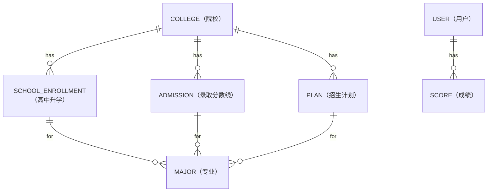
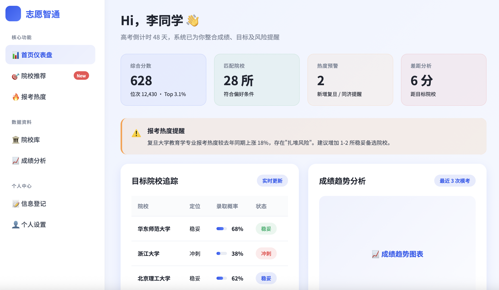
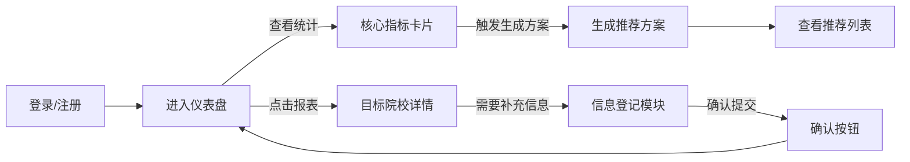
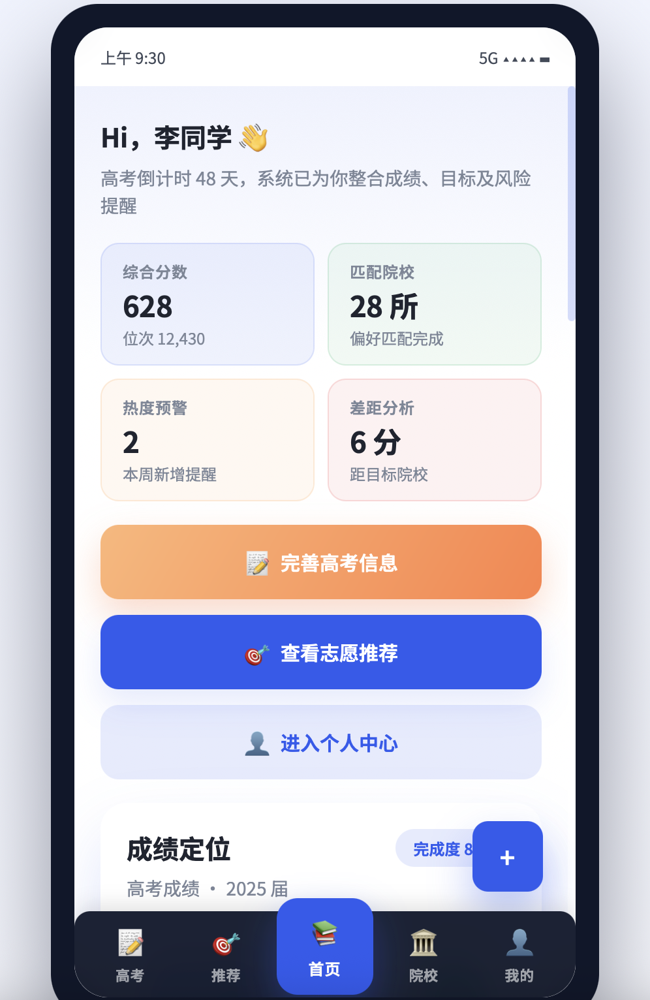
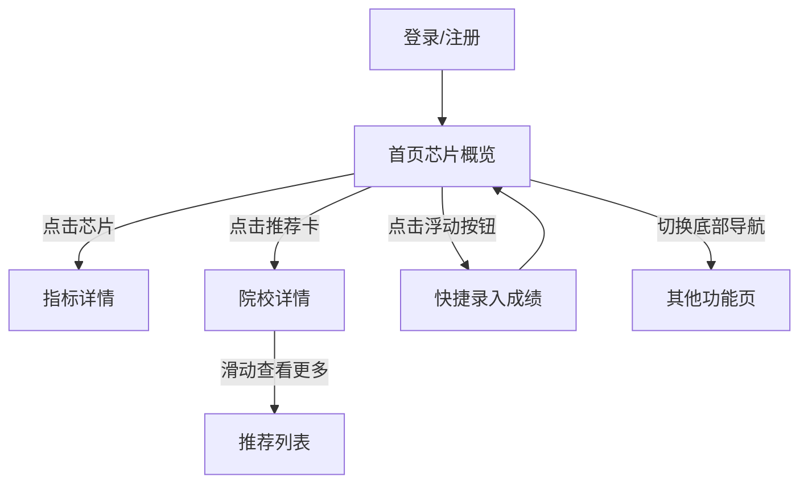
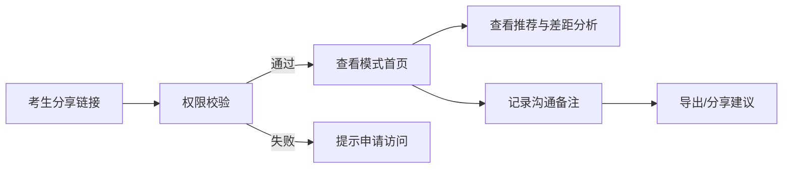
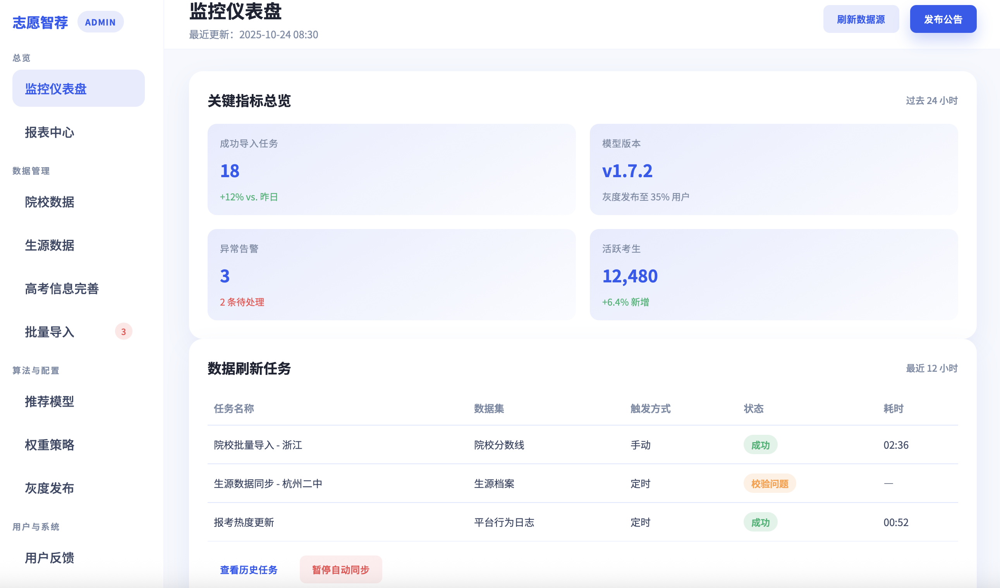
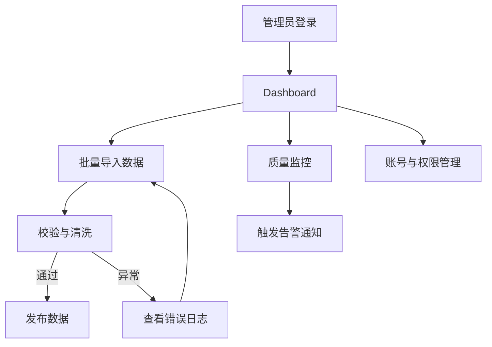

# 高考志愿填报推荐系统需求分析报告_初稿

## 一、项目概述

### 1.1 项目背景

高考志愿填报是学生升学过程中最重要的环节之一。由于录取分数线波动、政策调整以及信息不对称，考生在填报志愿时往往缺乏科学的参考依据，容易导致志愿浪费或录取风险。
为此，需要建设一个面向全国考生的志愿填报辅助系统，综合历年录取数据、生源信息及个人偏好，为考生提供科学的选校参考与建议。

### 1.2 术语与缩写

* 考生：使用系统进行志愿填报或备考分析的学生。
* 管理员：负责数据采集与维护的系统管理员。
* 生源数据：指各高中历年毕业生最终录取去向、排名等信息。
* 录取分数线数据：指各院校在各省份、各年份的录取分数、批次、最低分、平均分等。

### 1.3 使用者与角色

- **考生**：输入成绩、偏好及高中信息，获取院校匹配、差距分析和录取概率等建议。
- **家长 / 辅导老师**（隐含用户群体）：可查看考生的分析结果并提供建议（以考生账户或共享视图为准）。
- **系统管理员**：负责采集、整理、维护历年录取与生源数据，并保障数据可用性与准确性。

### 1.4 项目目标

设计并开发一款面向高考考生（填报志愿或备考阶段）的志愿填报辅助系统，目标如下：

- 采集并整理历年录取数据和高中生源数据；
- 提供基于历史数据的成绩匹配、录取参考和分数走势查询功能；
- 支持考生录入个人成绩、偏好信息，系统根据客观数据和主观偏好进行推荐；
- 提供录取概率预估和备考阶段的目标差距分析；
- 支持多设备使用，包括网页端、移动端和桌面端。


## 二、数据字典

### E-R 图



### 系统基础数据类

#### 院校信息

由两个表进行维护

+ 院校信息表：这个表只用于存放院校的基本信息，如院校名称、院校编码、所在省份及城市、院校等级、基础介绍等

| 字段名 | 数据类型 | 可为空 | 主键 | 说明 |
|--------|---------|------|------|--------|
| COLLEGE_ID | BIGINT | 否 | 是 | 院校ID |
| COLLEGE_CODE | VARCHAR(50) | 否 | 否 | 院校编码（如：10001） |
| COLLEGE_NAME | VARCHAR(100) | 否 | 否 | 院校名称 |
| COLLEGE_LEVEL | VARCHAR(20) | 否 | 否 | 院校等级（985、211、普通本科等） |
| PROVINCE | VARCHAR(64) | 否 | 否 | 所在省份 |
| CITY_NAME | VARCHAR(50) | 是 | 否 | 城市名称 |
| COLLEGE_TYPE | VARCHAR(20) | 是 | 否 | 院校类型（综合、理工等） |
| WEBSITE | VARCHAR(255) | 是 | 否 | 学校网址 |
| BASE_INTRO | TEXT | 是 | 否 | 院校基础介绍 |

+ 历年录取分数线表：维护各院校各专业历年的录取分数数据，是成绩匹配和差距分析的关键参考数据。

| 字段名 | 数据类型 | 可为空 | 主键 | 说明 |
|--------|---------|------|------|--------|
| ADMISSION_ID | BIGINT | 否 | 是 | 录取分数线ID |
| COLLEGE_ID | BIGINT | 否 | 否 | 院校ID |
| MAJOR_ID | BIGINT | 否 | 否 | 专业ID |
| PROVINCE | VARCHAR(64) | 否 | 否 | 录取省份 |
| ADMISSION_YEAR | YEAR | 否 | 否 | 录取年份 |
| MIN_SCORE | DECIMAL(5,1) | 否 | 否 | 最低分 |
| MIN_RANK | INT | 否 | 否 | 最低位次 |
| ENROLLMENT_COUNT | INT | 是 | 否 | 录取人数 |

+ 院校招生计划表：维护各院校各专业的录取指标，如最低分、最低位次、录取人数等。

| 字段名 | 数据类型 | 可为空 | 主键 | 说明 |
|--------|---------|------|------|--------|
| PLAN_ID | BIGINT | 否 | 是 | 计划ID |
| COLLEGE_ID | BIGINT | 否 | 否 | 院校ID |
| MAJOR_ID | BIGINT | 否 | 否 | 专业ID |
| PROVINCE | VARCHAR(64) | 否 | 否 | 招生省份 |
| ADMISSION_YEAR | YEAR | 否 | 否 | 招生年份 |
| PLAN_COUNT | INT | 否 | 否 | 招生计划数 |
| DESCRIPTION | VARCHAR(255) | 是 | 否 | 备注说明（这里用来给管理员添加一些额外的信息，比如有什么特殊指标变动） |


#### 高中生源

> 这里只作为演示，所以采用一个高中一个表只用于演示功能，实际中可能按照类似上面院校的方法更好一点

+ 高中升学表：维护高中升学信息，包括院校ID、毕业年份、录取专业ID、录取人数、最低分、最低位次

| 字段名 | 数据类型 | 可为空 | 主键 | 说明 |
|--------|---------|------|------|--------|
| SCHOOL_ENROLLMENT_ID | BIGINT | 否 | 是 | 高中升学ID |
| COLLEGE_ID | BIGINT | 是 | 否 | 院校ID |
| GRADUATION_YEAR | YEAR | 否 | 否 | 毕业年份 |
| MAJOR_ID | BIGINT | 是 | 否 | 录取专业ID |
| ADMISSION_COUNT | INT | 否 | 否 | 录取人数 |
| AVG_SCORE | DECIMAL(5,1) | 是 | 否 | 最低分 |
| MIN_RANK | INT | 是 | 否 | 最低位次 |


#### 专业 ID

+ 专业信息表：维护专业的基本信息，如专业名称、专业编码、专业类型等。

| 字段名 | 数据类型 | 可为空 | 主键 | 说明 |
|--------|---------|------|------|--------|
| MAJOR_ID | BIGINT | 否 | 是 | 专业ID |
| MAJOR_CODE | VARCHAR(50) | 否 | 否 | 专业编码（如：10001） |
| MAJOR_NAME | VARCHAR(100) | 否 | 否 | 专业名称 |
| MAJOR_TYPE | VARCHAR(20) | 是 | 否 | 专业类型（综合、理工等） |
| BASE_INTRO | TEXT | 是 | 否 | 专业基础介绍 |

### 用户相关

+ 用户信息表

| 字段名         | 数据类型      | 可为空 | 主键 | 说明  |
| ------------- | ------------ | ---- | --- | ---------------- |
| USER_ID       | BIGINT       | 否   | 是  | 用户ID |
| USERNAME      | VARCHAR(20)  | 否   | 否  | 用户名（5-20字符，字母数字） |
| PASSWORD      | VARCHAR(255) | 否   | 否  | 密码 |
| STATUS        | TINYINT      | 否   | 否  | 账户状态（1-正常，0-禁用）  |
| GENDER        | TINYINT      | 是   | 否  | 性别（1-男，2-女）      |
| PROVINCE      | VARCHAR(64)  | 否   | 否  | 考生所在省份           |
| SCHOOL_ID     | BIGINT       | 否   | 否  | 所在高中             |
| CREATED_AT    | DATETIME     | 否   | 否  | 创建时间             |

+ 考生成绩信息表

| 字段名 | 数据类型 | 可为空 | 主键 | 说明 |
|--------|---------|------|------|--------|
| SCORE_ID | BIGINT | 否 | 是 | 成绩ID |
| STUDENT_ID | BIGINT | 否 | 否 | 考生ID |
| EXAM_YEAR | YEAR | 否 | 否 | 高考年份 |
| PROVINCE | VARCHAR(64) | 否 | 否 | 考生所在省份 |
| TOTAL_SCORE | DECIMAL(5,1) | 否 | 否 | 高考总成绩 |
| RANK_IN_PROVINCE | INT | 是 | 否 | 省内排名 |


+ 志愿偏好本地 local storage

    这里采用本地存储的方式，每个用户在本地存储一个 JSON 字符串，存储用户的目标地区偏向、院校层次偏向、专业偏向及三者对应权重用于推荐结果的计算等。

```json
// 示例如下，其中，每个偏向可以有多个值
{
    "target_province": ["北京", "上海"],
    "target_college_level": ["985", "211"],
    "target_major": ["计算机科学与技术", "软件工程", "大数据"],
    "province_weight": 0.4,
    "college_level_weight": 0.35,
    "major_weight": 0.25
}
```


## 三、功能性需求

功能架构图：


1. 身份认证流程（黄色模块）
路径：用户访问 → 登录/注册判断 → 身份验证 → 进入系统
特点：支持新用户注册和老用户登录，验证失败有反馈循环

2. 用户端功能流程（蓝色模块）
高考信息统计：完成分数、位次、选科、地区等信息录入
推荐方案：核心功能，生成冲稳保推荐并支持参数调整
全部院校信息：提供院校查询、对比和详情查看
个人账号管理：信息修改和偏好设置

3. 服务端管理流程（紫色模块）
总览监控：实时监控系统运行状态和推荐效果
数据管理：管理院校数据、录取数据、用户数据等
算法与配置：动态调整权重参数和评分规则
用户反馈：收集反馈并用于算法优化


### 3.1 用户系统模块

功能内容
- 用户注册：支持账号+密码注册
- 用户登录：账号密码登录
- 密码重置
- 格式：
    账号：以大小写字母以及数字构成，长度控制在5-20个字母之间。
    密码：以大小写字母、数字以及特殊符号构成，长度在10-20个字符之间。

### 3.2 考生信息登记与基本展示模块

功能内容
- 考生信息登记：登录后，考生需填写自己的高考成绩（各科）或模拟测试成绩、高中信息、个人志愿偏好（目标地，专业等）等信息。
- 考生信息展示：系统应在考生登录后，展示其已登记的高考成绩在一分一段表中的位置、高中信息、个人志愿偏好等。
- 信息内容：
    - 省份：考生需输入自己所在省份，用于查询对应省份的院校历年录取数据。
    - 高中学校：考生需输入自己高中的名称，用于查询高中历史录取数据。
    - 高考成绩（各科）或模拟测试成绩：先选择考试类别（如高考、一模、二模等），再输入对应的各科或总体成绩。
    - 个人志愿偏好（目标地，专业等）：考生可以选择自己偏好的院校级别（如985，211等）、专业方向与目标地，并设置对应的权重

### 3.3 院校详情与显示模块

功能内容
- 院校详情查询：考生登录后，可输入目标院校名称或编号，查询该院校的详细信息（如院校介绍、专业方向、招生计划等）。
- 院校列表展示：系统应提供院校列表页面，展示所有已录入系统的院校信息（如院校名称、省份、招生计划人数等）。
- 院校排序：考生可根据自己的偏好（如目标地、专业等级、院校等级等），对院校列表进行排序和分类，展示符合条件的院校。

### 3.4 院校推荐与分析模块

功能内容
- 推荐院校列表：系统根据考生输入的成绩，结合客观数据（如历年录取分数、生源因素、录取指标、报考历史因素）与主观偏好（如目标地、专业方向、院校等级等），计算 Top K 录取概率，筛选院校，显示符合条件的院校列表。
- 推荐分析：系统应提供对推荐院校的详细分析，包括该院校的录取分数变化趋势、高中历史录取排名参考（对照该高中历年录取数据，给出与目标院校对应的参考排名区间或历史录取位次阈值）、录取概率、与考生个人偏好的匹配度等。

#### 推荐算法

本算法采用多因子加权排序方法，摒弃传统的硬性筛选方式，将每个影响因素作为加权因子，为所有院校专业组计算综合推荐得分，实现个性化、全面的志愿推荐。

```py
用户输入 → 偏好解析器 → 动态评分引擎 → 综合排序 → 结果标签化 → 推荐输出
     ↓          ↓           ↓          ↓          ↓
权重配置   评分规则生成   因子得分计算   加权排序   冲稳保分类
```

1. 输入处理
    - 接收用户基础信息（分数、位次、选科）
    - 解析用户偏好配置（地区/专业偏好、风险承受度等）

2. 动态评分计算
    - 位次匹配度：根据用户位次与院校录取位次的关系，计算录取概率得分（如：用户位次1200 vs 院校录取位次1000 → 冲刺区间得分）
    - 地区偏好：按用户自定义的梯队规则动态评分（如：北京=1.0，上海=0.9，其他=0.3）
    - 专业匹配度：根据专业吻合程度和用户偏好强度计算（如：完全匹配专业=1.0，相关专业=0.7）
    - 院校层次：985/211等标签量化评分
    - 选科符合度：硬性条件过滤或软性加权

3. 加权综合评分

```py
TotalScore = 
  (Rank_Score × 0.5) + 
  (Region_Score × 0.2) + 
  (Major_Score × 0.15) + 
  (UnivTier_Score × 0.1) + 
  (Subject_Score × 0.05)
```

4. 智能排序与标签化

- 多级排序：先按"冲稳保"标签排序，再按综合得分降序
- 动态标签：根据位次得分区间自动分类（如：得分0.75 → "冲"，得分0.9 → "稳"）

5. 输出结构化结果

- 每个推荐项包含：
    - 院校专业组信息
    - 综合得分与各因子得分详情
    - 推荐风险等级标签
    - 关键数据（如录取位次、专业组要求）

示例结果输出

```json
{
  "推荐院校": "北京大学-工科试验班",
  "综合得分": 0.872,
  "推荐标签": "冲",
  "得分详情": {
    "位次匹配": 0.75,    // 用户位次/院校位次=1200/1000
    "地区偏好": 1.0,     // 北京
    "专业匹配": 0.9,     // 含计算机专业
    "院校层次": 1.0     // 985
  },
  "关键数据": {
    "2024录取位次": 950,
    "专业组": ["计算机", "人工智能"],
    "学费": 5000
  }
}
```

##### 动态权重调整部分

1. 权重动态调整

原始权重 = {'位次':0.5, '地区':0.2, '专业':0.15, ...}

2. 偏好强度影响评分

不同专业偏好强度的评分差异：

```py
用户专业 = ["计算机"]
院校A专业 = ["计算机"]       # 完全匹配
院校B专业 = ["软件工程"]     # 相关专业
院校C专业 = ["土木工程"]     # 无关专业
```

#### 优势

1. 避免硬性筛选的局限性

传统方法：北京地区+物理化学 → 可能错过上海交大的优质选项

本算法：上海交大虽非北京，但其他因子优秀 → 仍可高排名推荐

2. 量化用户主观偏好

将"特别喜欢北京"转化为可计算的1.0分

将"勉强接受南方"量化为0.6分

3. 动态平衡竞争因素

当用户分数较高时，自动降低地区权重，突出院校层次

当用户有明确专业倾向时，提升专业匹配权重


#### 3.5 报考热度提示模块

功能内容
- 统计平台用户报考热度分布
- 分析院校历年报考与录取情况，并在检测到类似“某院校去年分数较低但今年报考热度上升”等情形时，向考生给出“扎堆风险”或相似提示。

#### 3.6 成绩现状分析模块

功能内容
- 展示考生当前成绩与目标院校目标院校历年分数线间的差距（以分数或位次形式呈现）。
- 展示考生与其目标院校相同目标群体的成绩统计（如平均分、排名分布的汇总描述），群体数据来自平台用户数据分析。
- 对考生单科成绩与目标群体单科平均分进行比较，并标注出相对强项与弱项，便于考生制定复习策略。


## 四、用户界面设计

### 4.1 设计原则

- **一致性**：网页端、移动端与管理员端共享统一的色彩（主色 #2C5BF0）、字体与图标语言，确保跨终端体验连贯。
- **可用性**：主要操作需置于显著位置，聚焦在“生成推荐”“导入成绩”“发布数据”等核心按钮，并提供状态反馈与二次确认。
- **响应式与无障碍**：PC 端采用响应式网格，移动端针对 390px 以上屏宽优化，控件满足≥44px 点击尺寸与足够对比度。
- **可扩展性**：导航、数据卡片、图表等组件模块化设计，方便接入真实数据后扩展或替换。

### 4.2 考生端界面

#### 4.2.1 网页端（PC）

- **登录/注册页**：位于 `/login`，居中卡片式布局，提供账号/密码输入、格式提示与标签切换组件；输入框聚焦时高亮描边并显示实时校验提示。
- **主应用框架**：左侧 280px 固定侧边栏提供导航（仪表盘、推荐、热度、院校库、分析、信息登记等），采用 `position: sticky` 以便滚动时保持可见；顶部 80px 全局头部包含面包屑、资料完成度徽章与操作按钮。
- **首页仪表盘**：首屏展示问候语与倒计时；通过四枚“统计芯片”显示综合分数、匹配院校数、热度预警、差距分析等指标，并使用 Success/Warning/Danger 等状态色区分。
- **数据展示**：目标院校追踪、录取进度、推荐方案等模块采用卡片 + 表格组合，支持 hover 强调；单科分析区域包含雷达图及说明文字。
- **信息登记流程**：每个表单区块含描述、状态提示与“确认信息”按钮；输入控件按双列网格排布，含考试类型选择、偏好芯片/权重滑杆、成绩录入等互动组件。
- **交互要求**：
    - 导航点击后更新内容区 `.page` 并同步高亮。
    - 关键按钮需有悬停、点击、禁用状态。
    - 表格/列表需预留排序、筛选控件位置。



##### 4.2.1.1 页面结构分解

| 区域 | 位置 | 内容要点 | 交互说明 |
| --- | --- | --- | --- |
| A. 侧边导航 | 左侧固定 | Logo、导航分组、状态徽章 | 支持折叠、hover 提示；根据页面切换高亮 |
| B. 顶部头部 | 顶部横向 | 面包屑、完成度、操作按钮、用户头像 | 完成度徽章点击展开进度详情，头像点击打开个人菜单 |
| C. 内容主区 | 右侧自适应 | 仪表盘统计卡片、推荐列表、热度提醒等 | 滚动独立，支持按模块跳转锚点 |
| D. 浮动操作 | 右下角预留 | “生成推荐方案”等高频操作 | 视滚动状态显示/隐藏，需提供悬浮提示 |

##### 4.2.1.2 关键组件状态

- **统计芯片**：默认状态浅色背景；当指标触发预警时显示 Warning/Danger 背景并附上 tooltip。
- **雷达图**：默认展示考生与目标院校平均水平；Hover 展示具体分值，空数据时显示占位提示。
- **信息确认按钮**：点击后切换为“已确认”状态并显示时间戳，同时弹出 toast 反馈。

##### 4.2.1.3 核心流程示意



#### 4.2.2 移动端（App/小程序）

- **登录/注册页**采用全屏渐变背景与顶部 Logo，内含切换标签；表单支持错误提示与密码可见性切换。
- **首页结构**：顶部展示问候语、倒计时；核心指标以两列自适应芯片呈现；下方提供快捷操作按钮（生成方案、导入成绩等），包含主按钮、高亮按钮和次级按钮样式。
- **推荐与分析**：院校推荐卡片含徽章、概率数值、标签与说明文案；单科分析模块配备雷达图与图例说明。
- **底部导航**：含“高考”“推荐”“首页”“院校”“我的”五项；`首页` 位于居中并高亮，激活态提升海拔并放大图标/文字；导航栏采用毛玻璃背景与圆角设计，适配刘海屏。
- **通用交互**：页面内容支持滚动，预留浮动操作按钮；筛选按钮、芯片、切换控件需提供点击反馈；保证在 390px 及以下屏宽内容仍可读。



##### 4.2.2.1 页面结构分解

| 区域 | 位置 | 内容要点 | 交互说明 |
| --- | --- | --- | --- |
| A. 欢迎区 | 主页首屏 | 问候语、倒计时、用户标签 | 依据考试阶段调整文案，点击倒计时跳转至日程页 |
| B. 指标芯片区 | 欢迎区下方 | 综合分、匹配院校、热度预警等 | 支持左右滑动查看更多指标，点击进入对应详细模块 |
| C. 推荐卡片区 | 中部 | 院校推荐卡片、标签、概率 | 卡片可收藏/隐藏，长按呼出反馈选项 |
| D. 底部导航 | 底部固定 | 五项主导航，中央首页突出 | 点击切换页面，同时更新浮动操作按钮 |

##### 4.2.2.2 交互与状态

- 底部导航：激活态提升阴影与圆角，未读状态通过红点提示。
- 推荐卡片：支持左右滑动切换，同步更新概率说明；若无推荐数据，展示空状态插画并提示完善信息。
- 浮动按钮：在非首页时显示“快速添加成绩”，点击打开半屏抽屉录入。

##### 4.2.2.3 核心流程示意



### 4.3 *家长 / 辅导老师视图

- 提供基于考生端的“查看模式”，通过共享链接或家庭账号访问。
- 默认隐藏编辑入口，仅展示分析结果、推荐列表、热度提醒等信息；可新增“沟通备注”入口供家长记录意见。
- 页面需强化数据解释元素（概率说明、热度警示）并提供导出/分享按钮。


##### 4.3.1 查看模式流程



##### 4.3.2 关键界面说明

- 查看模式 Banner 提供“当前数据更新于 XX:XX”信息，便于判断数据时效。
- 推荐列表仅保留“标记为关注”功能，不允许直接编辑成绩或偏好。
- 备注面板支持 Markdown 简单语法与导出 PDF。


### 4.4 管理员界面（数据运营端）

- **布局**：左侧导航栏覆盖数据中心、任务看板、质量监控、用户反馈；右侧主体含顶部头部（任务状态、快捷按钮）与内容区。
- **仪表盘**：呈现数据同步状态、待处理告警、资源占比等指标，结合统计卡片、趋势图、表格；支持筛选日期、省份、数据源类型。
- **数据管理**：
    - 导入页面提供批量上传、模板下载、任务进度条与错误日志列表。
    - 校验结果列表支持状态筛选（待校验、异常、已发布）与行内操作（重新校验、下线）。
    - 数据质量卡片显示通过率、异常率、更新时间，并使用风险徽章标识。
- **账号与权限**：用户列表展示账号、角色、最近活跃时间，可通过抽屉式弹窗编辑角色或禁用。
- **支撑工具**：侧栏底部保留帮助/支持卡片，包含操作指引与客服入口。



##### 4.4.1 管理员主流程



##### 4.4.2 界面组件与状态

- **数据导入表单**：包含上传区域、模板下载按钮、进度条与成功/失败提示；失败记录需支持逐条下载并再次上传。
- **质量监控卡片**：展示数据覆盖率、更新频次、异常率等指标，支持按省份/年份筛选，并提供导出 CSV。
- **用户管理**：列表内含角色标签、状态提醒；禁用账号需弹出确认对话框并记录原因。


## 五、非功能性需求

### 5.1 性能要求

1. **响应速度**
   - 页面加载：首页及核心功能页面（如院校推荐、成绩分析）首次加载时间≤3 秒，二次加载（含缓存）≤1 秒。
   - 数据查询：院校详情查询、录取概率计算等核心操作响应时间≤2 秒，支持每秒至少 100 并发查询请求。
   - 数据更新：管理员上传年度录取数据时，单批次数据（≤10 万条记录）处理时间≤5 分钟，且不影响用户正常使用。
2. **系统稳定性**
   - 服务可用性：全年服务可用率≥99.9%，高考志愿填报高峰期（如各省填报窗口开放期间）可用率≥99.99%。
   - 并发支持：支持同时在线用户≥10 万人，峰值时段（如每日 18:00-22:00）并发用户≥2 万人时无明显性能下降。
   - 容错能力：单节点故障时自动切换至备用节点，切换时间≤30 秒，且用户操作数据不丢失。
3. **数据处理能力**
   - 历史数据存储：支持至少 10 年全国院校录取数据（预估≥1000 万条记录）的结构化存储与高效检索。
   - 实时分析：支持对平台用户报考热度数据的实时统计（延迟≤5 分钟），并触发风险提示规则判断。

### 5.2 安全与隐私要求

1. **用户数据安全**
   - 身份认证：采用密码加盐哈希存储（如 bcrypt 算法），禁止明文存储；登录支持验证码机制，连续 5 次密码错误触发账户临时锁定（15 分钟）。
   - 数据传输：全平台采用 HTTPS 加密传输，敏感数据在传输层额外进行 AES-256 加密。
   - 权限控制：基于角色的访问控制（RBAC），考生仅可查看本人数据，管理员操作需二次身份验证（如短信验证码），所有敏感操作（如数据删除）留存审计日志。
   - 数据备份：核心数据每日凌晨全量备份 + 实时增量备份，备份数据加密存储且异地留存，支持 72 小时内数据快速回滚。
2. **隐私保护机制**
   - 数据最小化采集：仅收集必要信息（如成绩、省份等），禁止采集与志愿填报无关的隐私数据（如家庭住址、联系方式等非必要信息）。
   - 匿名化处理：用户数据在用于群体分析前进行匿名化处理，去除个人标识（如姓名、账号 ID），仅保留可聚合的特征字段（如省份、成绩区间、高中名称等）。
   - 聚合分析限制：群体数据统计结果仅以 “平均分、排名分布、占比” 等聚合形式展示，禁止输出可定位到个体的信息（如某高中某分数段仅 1 人时，不展示具体分数）。
   - 用户授权：明确告知用户数据用途（如 “您的成绩将用于群体分析以优化推荐准确性”），用户可在系统设置中自主关闭非必要数据的分析授权（关闭后不影响个人推荐功能）。
   - 合规性：符合《个人信息保护法》《数据安全法》要求，明确数据留存期限（高考志愿填报结束后，用户可自主选择删除数据或保留 1 年用于次年参考）。

### 5.3 可扩展性要求

- 架构设计：采用微服务架构，支持用户模块、数据采集模块、推荐算法模块的独立扩容，应对用户量增长或功能迭代需求。
- 数据接口：预留标准化 API 接口，支持对接各省教育考试院官方数据平台，实现录取数据的自动同步更新。
- 功能扩展：系统设计预留自定义推荐规则配置入口，支持管理员根据政策调整（如高考改革、批次调整）灵活修改推荐算法参数。

### 5.4 易用性要求

- 操作流程：核心功能（如成绩录入、志愿推荐）操作步骤≤3 步，界面引导清晰，提供 “新手引导” 弹窗与操作帮助文档。
- 信息展示：录取概率、分数差距等关键数据采用可视化图表（如折线图、柱状图）展示，文字说明简洁易懂（避免专业术语，必要时提供术语解释）。
- 错误提示：用户操作错误（如成绩格式错误）时，提示信息具体明确（如 “请输入 750 分制的总分，范围 0-750”），并提供修正建议。
