- # 高考志愿填报系统 - 前端设计文档

  ---

  ## 1. 项目概述

  高考志愿填报辅助系统是一款面向高考考生的移动端应用，旨在通过智能推荐算法、数据分析和可视化工具，帮助考生科学合理地填报高考志愿。

  ### 1.1 核心功能

  - **高考信息管理**：录入和管理考生成绩、排名等关键信息
  - **智能推荐**：基于考生情况和偏好权重的院校推荐
  - **院校查询**：全面的院校信息查询和收藏功能
  - **热度分析**：实时监测院校报考热度变化
  - **个人中心**：账户管理、偏好设置、通知管理

  ### 1.2 设计目标

  - **易用性**：简洁直观的界面，降低学习成本
  - **专业性**：数据准确，分析科学
  - **情感化**：温和舒适的视觉体验，减轻考生压力
  - **高效性**：快速完成信息录入和决策支持

  ---

  ## 2. 设计系统

  ### 2.1 色彩系统

  #### 主色调

  | 色彩名称         | HEX 值    | RGB 值          | 用途                   |
  | ---------------- | --------- | --------------- | ---------------------- |
  | Primary Blue     | `#2C5BF0` | `44, 91, 240`   | 主要操作按钮、强调元素 |
  | Light Blue       | `#5B7FFF` | `91, 127, 255`  | 渐变色、次要强调       |
  | Background Blue  | `#EFF3FF` | `239, 243, 255` | 页面背景               |
  | Light Background | `#FAFBFF` | `250, 251, 255` | 渐变背景               |

  #### 功能色

  | 色彩名称       | HEX 值    | 用途                       |
  | -------------- | --------- | -------------------------- |
  | Success Green  | `#21B573` | 成功状态、热度下降（机会） |
  | Warning Orange | `#FF9500` | 警告提示、重要信息         |
  | Error Red      | `#F04F52` | 错误状态、热度上涨（风险） |
  | Info Cyan      | `#00B8D4` | 信息提示                   |

  #### 中性色

  | 色彩名称       | HEX 值    | 用途                 |
  | -------------- | --------- | -------------------- |
  | Dark Primary   | `#1F2430` | 主要文本、导航栏背景 |
  | Secondary Text | `#7C8698` | 次要文本、说明文字   |
  | Border Gray    | `#E8ECF4` | 边框、分割线         |
  | Light Gray     | `#F5F7FB` | 卡片背景、禁用状态   |

  ---

  ### 2.2 排版系统

  #### 字体家族

  - **主字体**：System Default (SF Pro / Roboto)
  - **备用字体**：PingFang SC, Microsoft YaHei

  #### 字体规范

  | 类型          | 字号 | 字重 | 行高 | 用途               |
  | ------------- | ---- | ---- | ---- | ------------------ |
  | Display Large | 34px | 700  | 1.2  | 特大标题、数字展示 |
  | Display Small | 24px | 700  | 1.3  | 页面主标题         |
  | Title Large   | 20px | 600  | 1.4  | 卡片标题           |
  | Title Medium  | 16px | 600  | 1.4  | 子标题             |
  | Title Small   | 14px | 600  | 1.4  | 小标题             |
  | Body Large    | 16px | 400  | 1.5  | 正文（强调）       |
  | Body Medium   | 14px | 400  | 1.5  | 正文               |
  | Body Small    | 12px | 400  | 1.5  | 说明文字、标签     |
  | Caption       | 11px | 400  | 1.4  | 次要说明           |

  #### 字间距

  - **正常文本**：0.2px
  - **强调文本**：0.6px

  ---

  ### 2.3 间距系统

  基于 4px 基准单位的间距系统：

  | 名称 | 数值 | 用途         |
  | ---- | ---- | ------------ |
  | xs   | 4px  | 最小间距     |
  | sm   | 8px  | 紧密元素间距 |
  | md   | 12px | 标准元素间距 |
  | lg   | 16px | 卡片内边距   |
  | xl   | 20px | 页面边距     |
  | 2xl  | 24px | 区块间距     |
  | 3xl  | 32px | 大区块间距   |

  ---

  ### 2.4 圆角系统

  | 名称   | 数值 | 应用       |
  | ------ | ---- | ---------- |
  | Small  | 8px  | 按钮、标签 |
  | Medium | 12px | 小卡片     |
  | Large  | 16px | 普通卡片   |
  | XL     | 20px | 大卡片     |
  | 2XL    | 22px | 特殊容器   |
  | 3XL    | 28px | 个人信息卡 |

  ---

  ### 2.5 阴影系统

  #### 卡片阴影

  ```css
  /* 轻度阴影 */
  box-shadow: 0px -4px 16px rgba(0, 0, 0, 0.1);
  
  /* 悬浮按钮阴影 */
  box-shadow: 0px 16px 32px rgba(44, 91, 240, 0.35);
  
  /* 导航栏阴影 */
  box-shadow: 0px 14px 28px rgba(44, 91, 240, 0.35);
  
  /* 个人卡片阴影 */
  box-shadow: 0px 16px 32px rgba(44, 91, 240, 0.25);
  ```

  ---

  ## 3. 应用架构

  ### 3.1 信息架构

  ```
  应用入口流程
  ├── 启动页 (Splash)
  └── 认证流程
      ├── 登录页 (Login Page)
      │   ├── 账号密码登录
      │   ├── 记住密码
      │   └── 跳转注册
      └── 注册页 (Register Page)
          ├── 基本信息填写
          ├── 省份选择
          ├── 学校信息
          └── 返回登录
  
  ↓ 登录成功后进入
  
  应用主框架 (HomeShell)
  ├── 高考信息 (InfoPage) [索引0]
  │   ├── 成绩录入
  │   ├── 数据分析
  │   └── AI分析报告
  ├── 推荐 (RecommendPage) [索引1]
  │   ├── 智能推荐列表
  │   ├── 偏好权重调整
  │   └── 保存推荐方案
  ├── 首页 (DashboardPage) [索引2] - 默认页
  │   ├── 快速导航
  │   ├── 数据概览
  │   └── 快捷入口
  ├── 院校 (CollegePage) [索引3]
  │   ├── 院校搜索
  │   ├── 院校详情
  │   └── 收藏管理
  └── 我的 (ProfilePage) [索引4]
      ├── 个人信息
      ├── 账户设置
      └── 系统设置
  ```

  ---

  ### 3.2 导航系统

  #### 底部导航栏

  - **位置**：固定在屏幕底部
  - **背景色**：深色半透明 `rgba(15, 23, 42, 0.95)`
  - **圆角**：顶部 16px 圆角
  - **高度**：适配 SafeArea，约 70-80px
  - **导航项数量**：5 个

  #### 导航项设计

  | 图标                      | 标签 | 索引 | 功能描述         |
  | ------------------------- | ---- | ---- | ---------------- |
  | `edit_note_rounded`       | 高考 | 0    | 高考信息管理     |
  | `track_changes_rounded`   | 推荐 | 1    | 智能推荐列表     |
  | `home_filled`             | 首页 | 2    | 应用主页（默认） |
  | `account_balance_rounded` | 院校 | 3    | 院校查询         |
  | `person_rounded`          | 我的 | 4    | 个人中心         |

  #### 选中状态设计

  - **背景**：Primary Blue `#2C5BF0`
  - **圆角**：16px
  - **阴影**：`0px 14px 28px rgba(44, 91, 240, 0.35)`
  - **内边距**：horizontal 6px, vertical 12px
  - **上移动画**：选中时上移 6px
  - **图标尺寸**：选中 24px，未选中 22px
  - **文字大小**：选中 12px，未选中 11px
  - **文字颜色**：选中白色，未选中 60% 透明度白色

  

  ---

  ### 3.3 浮动操作按钮 (FAB)

  #### 位置和样式

  - **位置**：右下角，bottom: 108px, right: 24px
  - **尺寸**：56x56px
  - **背景色**：Primary Blue `#2C5BF0`
  - **圆角**：16px
  - **阴影**：`0px 16px 32px rgba(44, 91, 240, 0.35)`
  - **图标颜色**：白色
  - **图标尺寸**：30px

  #### 根据页面变化

  | 页面索引 | 图标                | 功能         | Tooltip      |
  | -------- | ------------------- | ------------ | ------------ |
  | 0 (高考) | `add_chart_rounded` | 快速录入成绩 | 快速录入成绩 |
  | 1 (推荐) | `save_rounded`      | 保存推荐方案 | 保存推荐方案 |
  | 2 (首页) | `favorite_rounded`  | 我的收藏     | 我的收藏     |
  | 3 (院校) | 隐藏                | -            | -            |
  | 4 (我的) | 隐藏                | -            | -            |

  ---

  ## 4. 页面设计详解

  ### 4.0 登录注册页面 (Auth Pages)

  #### 4.0.1 设计目标

  - 提供简洁流畅的用户认证体验
  - 降低注册门槛,快速完成账号创建
  - 安全可靠的身份验证机制
  - 友好的错误提示和引导

  ---

  #### 4.0.2 登录页 (Login Page)

  ##### 页面结构

  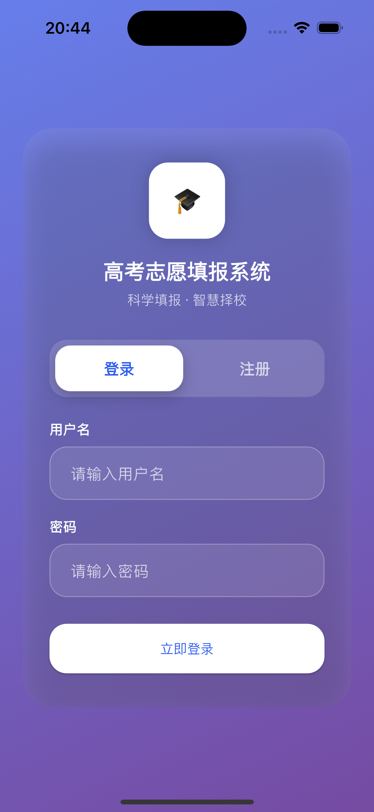

  ##### 设计规范

  **顶部装饰区**

  - **背景**：蓝色渐变 `#2C5BF0` → `#5B7FFF`
  - **高度**：40% 屏幕高度
  - **Logo尺寸**：120x120px
  - **Logo背景**：白色圆形，阴影 `0px 8px 24px rgba(44, 91, 240, 0.3)`
  - **应用名称**：Display Small (24px), 字重 700, 白色
  - **欢迎标语**：Body Medium (14px), 白色 80% 透明度
  - **布局**：垂直居中对齐

  **表单区域**

  - **背景**：白色卡片
  - **圆角**：顶部 32px 圆角
  - **内边距**：horizontal 24px, vertical 32px
  - **位置**：覆盖在装饰区底部，形成卡片悬浮效果

  **输入框设计**

  - **输入框间距**：16px
  - **输入框样式**：Material Design outlined style

  **页面边距**

  - **水平边距**：24px
  - **垂直间距**：表单元素间 16-24px

  ---

  #### 4.0.3 注册页 (Register Page)

  ##### 页面结构

  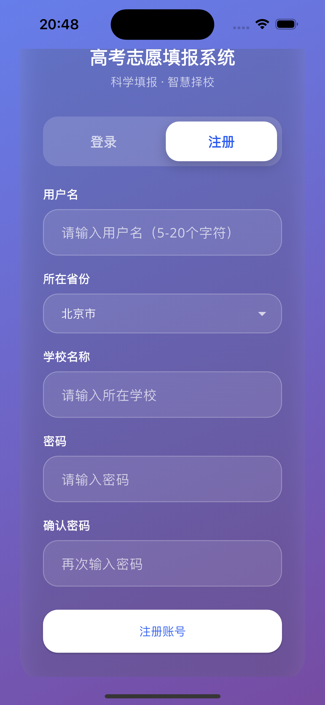

  ##### 设计规范

  - 同登录页

  **表单验证规则**

  | 字段     | 必填 | 验证规则   | 错误提示                       |
  | -------- | ---- | ---------- | ------------------------------ |
  | 用户名   | 是   | 5-20个字符 | "用户名长度需在2-20个字符之间" |
  | 密码     | 是   | 6-20个字符 | "密码长度需在6-20个字符之间"   |
  | 确认密码 | 是   | 与密码一致 | "两次输入的密码不一致"         |
  | 省份     | 是   | 必须选择   | "请选择高考所在省份"           |
  | 学校     | 否   | 最多50字符 | "学校名称过长"                 |

  ---

  ### 4.1 首页 (Dashboard Page)

  #### 设计目标

  - 提供快速访问各功能模块的入口
  - 展示关键数据和进度
  - 引导用户完成核心任务

  #### 页面结构

  ```
  首页
  ├── 顶部区域
  │   └── 欢迎信息 / 用户状态
  ├── 数据概览卡片区
  │   ├── 成绩统计
  │   ├── 推荐院校数
  │   └── 收藏院校数
  ├── 快捷操作区
  │   ├── 录入成绩
  │   ├── 查看推荐
  │   ├── 院校搜索
  │   └── 热度分析
  └── 底部空白区 (120px)
  ```

  #### 设计规范

  - **页面边距**：horizontal 20px, top 24px, bottom 120px
  - **背景渐变**：从 `#EFF3FF` 到 `#FAFBFF`
  - **卡片间距**：24px
  - **卡片圆角**：22px

  

  **首页展示**

  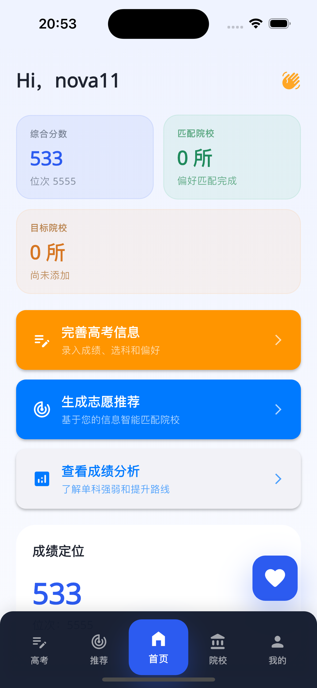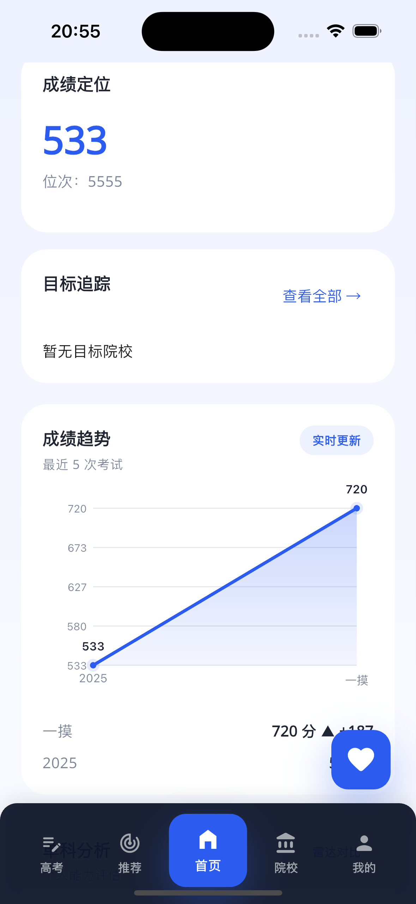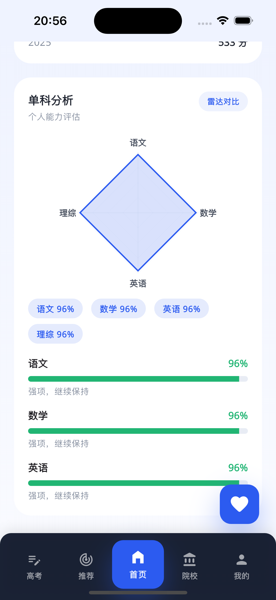

  

  ---

  ### 4.2 高考信息页 (Info Page)

  #### 设计目标

  - 方便考生快速录入和管理高考成绩
  - 提供成绩分析和可视化
  - 支持查看AI分析报告

  #### 页面组件

  ##### 成绩录入卡片

  - **标题**：我的成绩
  - **内容**：
    - 总分输入框
    - 省内排名输入框
    - 科目成绩（可选）
  - **操作**：保存按钮

  ##### 快速操作

  通过浮动按钮触发底部弹窗：

  - **弹窗标题**：快速录入成绩
  - **输入项**：
    - 总分
    - 省内排名
  - **按钮**：取消 / 保存

  **高考信息页**

  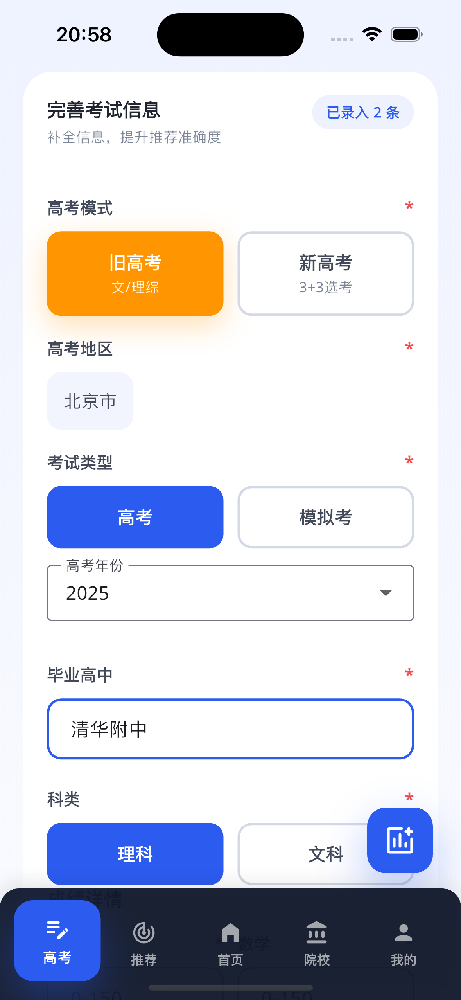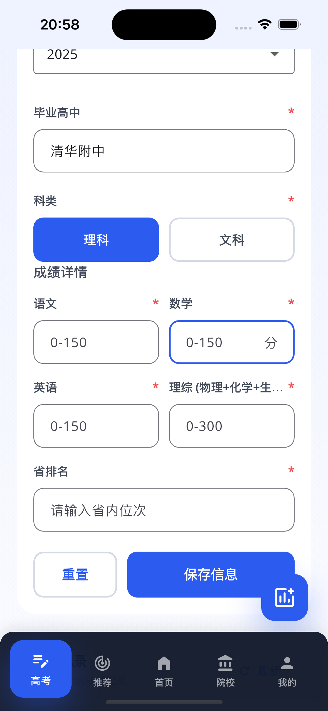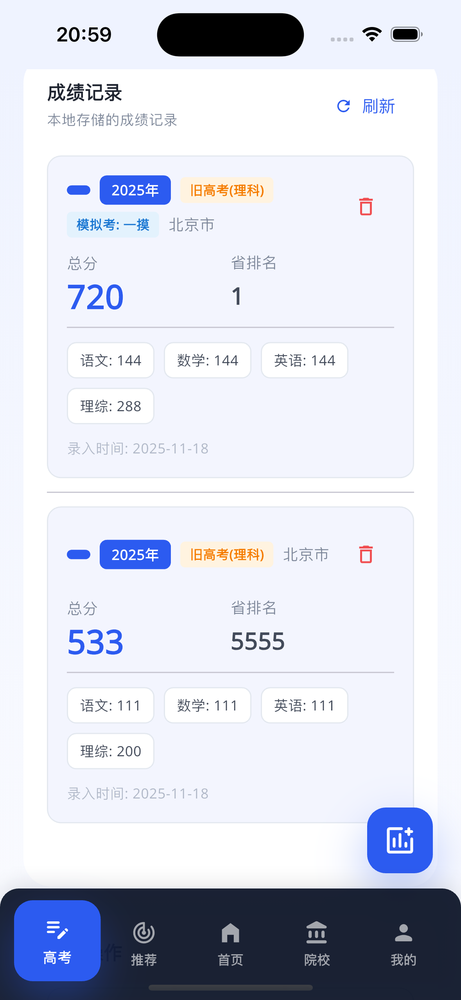

  

  **快速录入弹窗**

  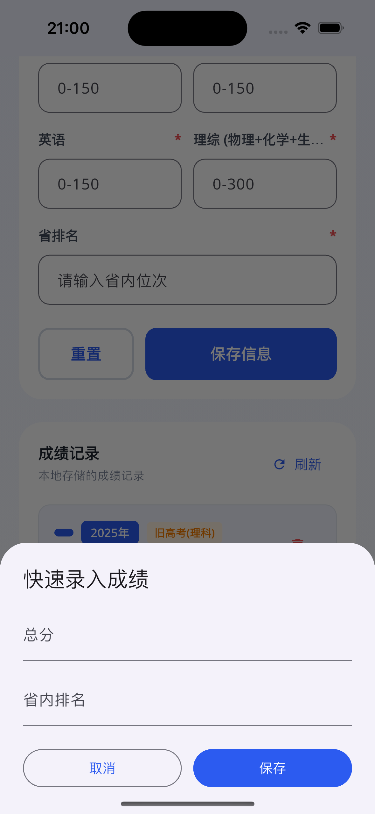

  ---

  ### 4.3 推荐页 (Recommend Page)

  #### 设计目标

  - 基于算法展示个性化院校推荐
  - 支持调整偏好权重
  - 保存和管理推荐方案

  #### 页面结构

  ```
  推荐页
  ├── 顶部统计概览卡片
  ├── 只能推荐方案
  │   ├── 算法说明：客观数据80% + 主观偏好20%
  │   ├── 权重调整面板（可折叠）
  │   └── 三因素权重分配：地区、层次、专业方向
  ├── 偏好权重调整入口
  ├── 推荐结果展示
  └── 浮动操作：保存方案
  ```

  #### 推荐院校卡片设计

  - **背景**：白色卡片，圆角 20px
  - **边框**：`#E8ECF4`
  - **内边距**：16-20px
  - **包含信息**：
    - 院校名称（Title Medium, 加粗）
    - 专业名称（Body Small, 灰色）
    - 推荐类型标签（冲刺/稳妥/保底）
    - 录取概率百分比
    - 历年分数线
    - 操作按钮（收藏、查看详情）

  **推荐页**

  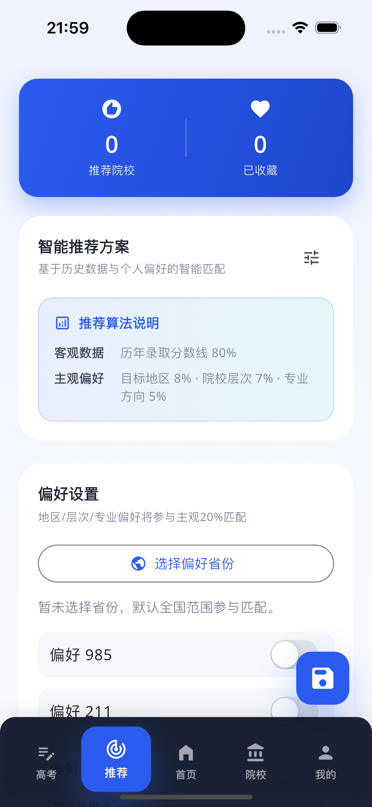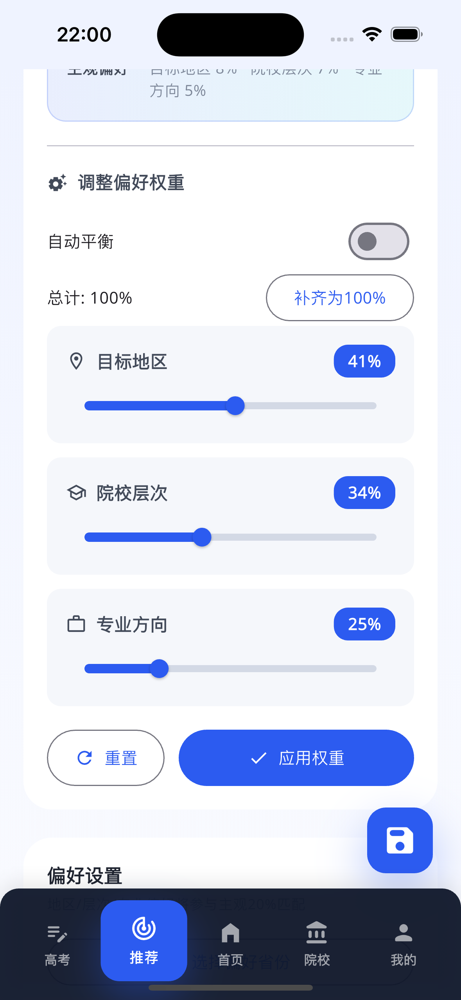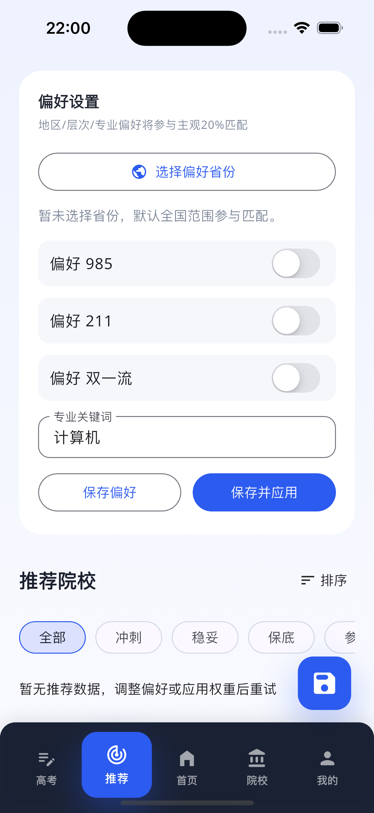

  ---

  ### 4.4 院校页 (College Page)

  #### 设计目标

  - 提供全面的院校信息查询
  - 支持多维度搜索和筛选
  - 展示院校详细信息

  #### 页面结构

  **双标签页设计：**

  1. **全国院校库标签页**
     - 搜索栏（实时搜索院校名称）
     - 高级筛选面板（省份、985/211/双一流标签）
     - 院校卡片列表（支持无限滚动加载）
     - 院校详情弹窗（底部抽屉式）
  2. **高中录取标签页**
     - 筛选条件（院校名称、毕业年份）
     - 录取记录卡片（展示历年录取数据）

  #### 核心功能特性

  **搜索与筛选**

  - 实时搜索：输入时自动触发搜索，支持防抖处理
  - 多条件筛选：省份选择、院校标签（985/211/双一流）
  - 筛选状态可视化：激活的筛选条件高亮显示

  **院校卡片设计**

  dart

  ```
  院校卡片包含：
  - 院校名称（突出显示）
  - 标签系统：985/211/双一流/省份标签
  - 交互反馈：点击展开详情弹窗
  - 视觉层次：卡片阴影、圆角、悬停效果
  ```

  

  **院校详情弹窗**

  - 可拖拽底部弹窗，支持多种高度状态
  - 双标签页布局：院校信息 + 历年录取
  - 录取数据筛选：按省份、年份动态筛选

  **数据展示**

  - 院校基础信息：省份、城市、类型、标签
  - 录取数据详情：专业名称、科类、年份、最低分、最低位次
  - 分页加载：支持无限滚动，优化性能

  **全国院校页**

  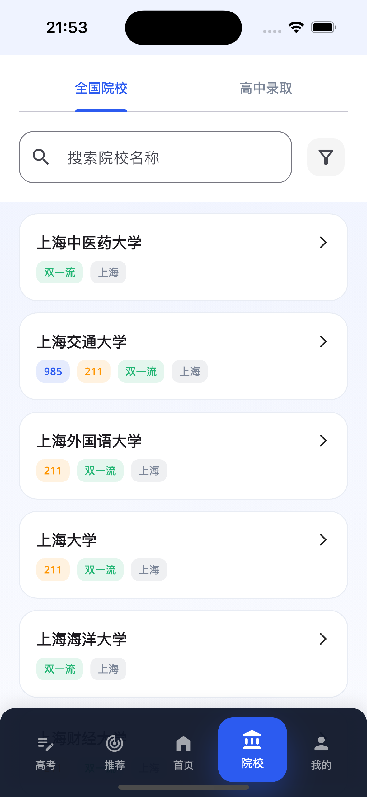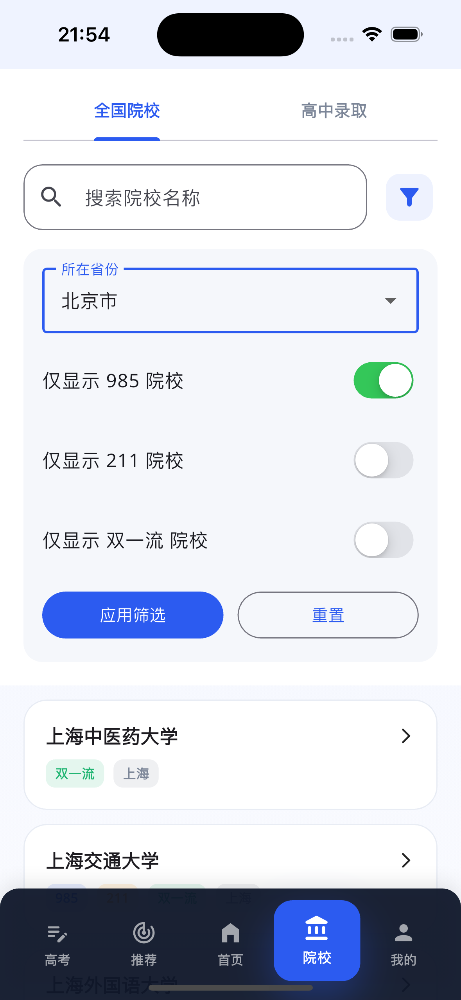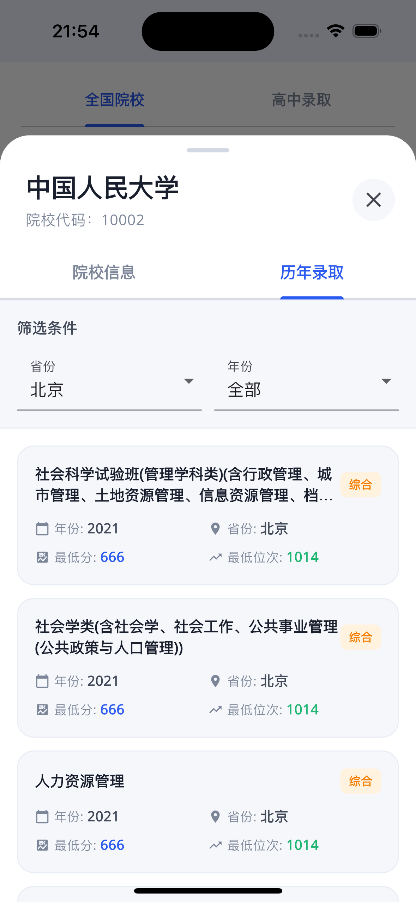

  **高中录取页**

  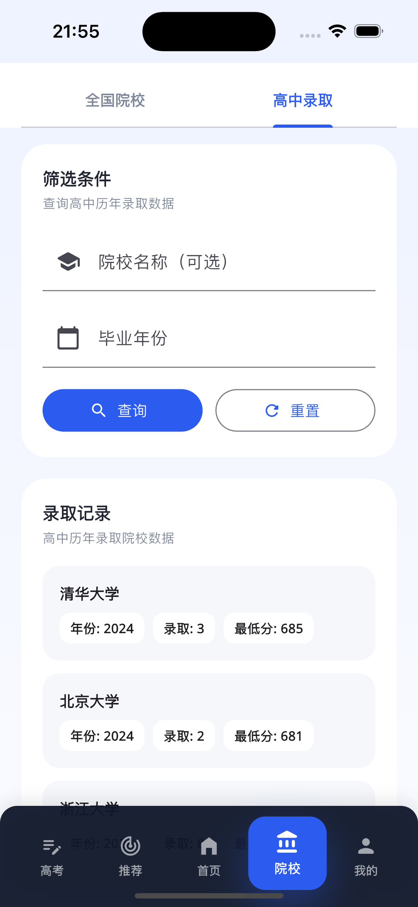

  ---

  ### 4.5 我的页面 (Profile Page)

  #### 设计目标

  - 展示个人信息和账户状态
  - 提供账户和系统设置入口
  - 支持账户管理功能

  #### 页面结构

  ```
  我的页面
  ├── 个人名片区
  │   ├── 头像
  │   ├── 用户名
  │   ├── 用户ID
  │   └── 快速信息（省份、学校）
  ├── 功能中心
  │   ├── 账户信息
  │   ├── 偏好权重
  │   └── 通知提醒
  ├── 清除本地数据按钮
  └── 退出登录按钮
  ```

  #### 个人名片设计

  - **背景**：蓝色渐变 `#2C5BF0` → `#5B7FFF`
  - **圆角**：28px
  - **阴影**：`0px 16px 32px rgba(44, 91, 240, 0.25)`
  - **内边距**：24px
  - **头像**：
    - 尺寸：72x72px
    - 形状：圆形
    - 背景：白色
    - 内容：用户名首字母大写

  #### 功能入口设计

  - **卡片背景**：白色
  - **边框**：`#E8ECF4`
  - **圆角**：20px
  - **内边距**：18px
  - **图标容器**：
    - 尺寸：48x48px
    - 圆角：14px
    - 背景：对应功能色 12% 透明度
  - **布局**：横向，图标+标题说明+箭头

  #### 操作按钮

  - **清除数据按钮**：
    - 背景色：Warning Orange
    - 高度：52px
    - 圆角：默认
    - 图标：`delete_outline`

  - **退出登录按钮**：
    - 背景色：Error Red
    - 高度：52px
    - 圆角：默认
    - 图标：`logout_rounded`

  **我的页面**

  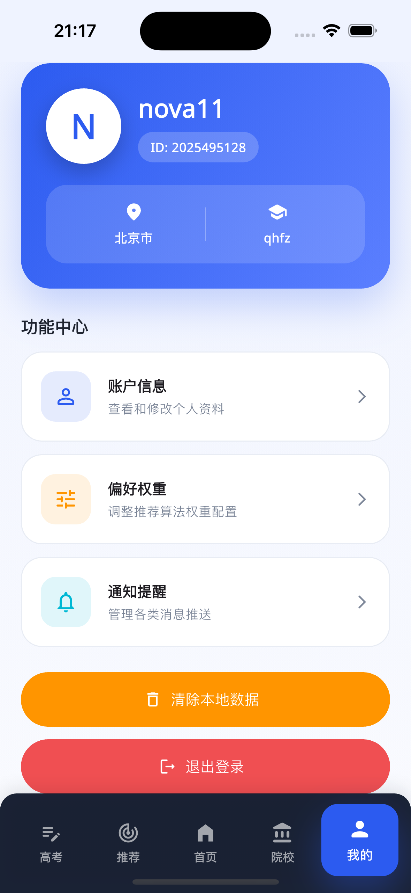

  ---

  ### 4.6 个人信息编辑页 (Profile Edit Page)

  #### 页面结构

  ```
  个人信息编辑页
  ├── 导航栏
  │   ├── 返回按钮
  │   └── 页面标题
  ├── 基本资料区
  │   ├── 姓名输入框
  │   ├── 账号ID（只读）
  │   ├── 所在省份（只读）
  │   └── 毕业高中输入框
  ├── 账户安全区
  │   └── 修改密码
  │       ├── 展开/收起按钮
  │       ├── 旧密码输入框
  │       ├── 新密码输入框
  │       └── 确认修改按钮
  └── 保存修改按钮（底部固定）
  ```

  #### 设计规范

  - **导航栏**：白色背景，无阴影
  - **内容区边距**：20px
  - **表单控件**：Material Design 风格
  - **输入框样式**：
    - 下划线模式
    - 带前缀图标
    - Label浮动动画

  #### 密码修改展开动画

  - **动画类型**：CrossFade
  - **动画时长**：250ms
  - **展开内容**：旧密码、新密码输入框和确认按钮

  **个人信息编辑页**

  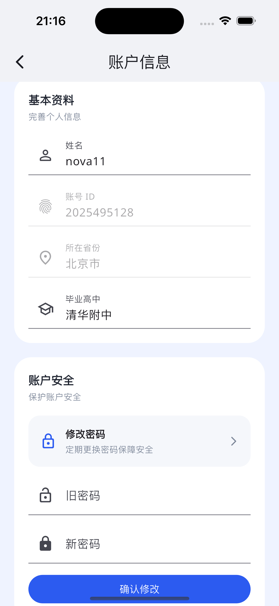

  ---

  ### 4.7 偏好权重页 (Profile Weight Page)

  #### 设计目标

  - 允许用户自定义推荐算法权重
  - 可视化展示各项权重配置
  - 实时预览权重变化影响

  #### 页面结构

  ```
  偏好权重页
  ├── 导航栏
  ├── 权重说明卡片
  ├── 权重调整区
  │   ├── 地域偏好（滑块）
  │   ├── 院校层次（滑块）
  │   └── 专业偏好（滑块）
  └── 保存设置按钮
  ```

  #### 滑块设计

  - **轨道高度**：4px
  - **拇指尺寸**：24x24px
  - **激活颜色**：Primary Blue
  - **范围**：0-100
  - **步长**：5
  - **实时反馈**：显示当前百分比值

  **偏好权重页**

  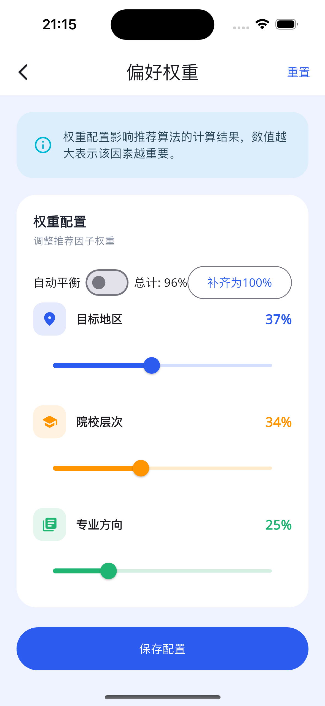

  ---

  ### 4.8 通知设置页 (Profile Notification Page)

  #### 页面结构

  ```
  通知设置页
  ├── 导航栏
  └── 推送通知区
      ├── 热度预警通知（开关）
      ├── 推荐院校变化通知（开关）
      └── 系统消息（开关）
  ```

  #### 通知开关设计

  - **布局**：图标 + 标题说明 + Switch
  - **图标容器**：
    - 尺寸：40x40px
    - 圆角：12px
    - 背景：对应颜色 12% 透明度
  - **Switch控件**：Material Design Adaptive

  #### 通知类型

  | 通知类型 | 图标                           | 颜色           | 默认状态 |
  | -------- | ------------------------------ | -------------- | -------- |
  | 热度预警 | `warning_amber_rounded`        | Error Red      | 开启     |
  | 推荐变化 | `auto_awesome_rounded`         | Warning Orange | 开启     |
  | 系统消息 | `notifications_active_rounded` | Info Cyan      | 开启     |

  **通知设置页**

  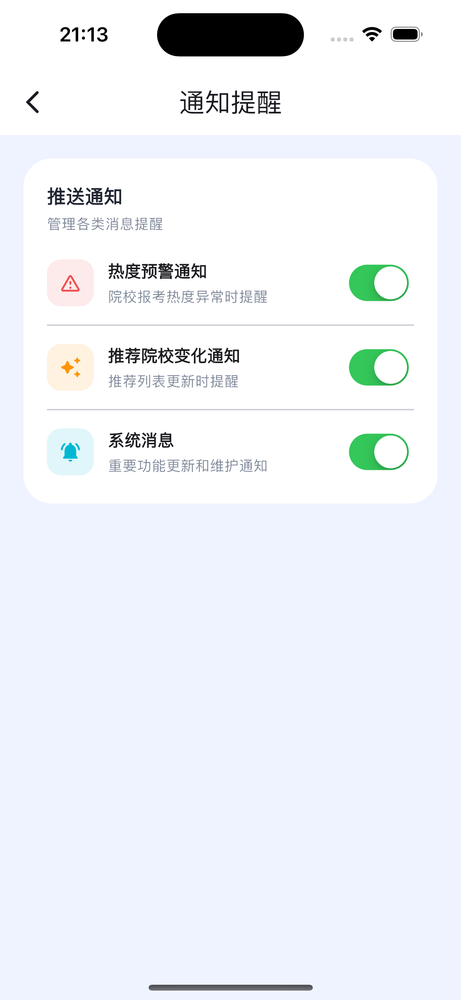

  ---

  ### 4.9 AI分析报告页 (Score AI Analysis Page)

  #### 设计目标

  - 提供基于成绩的AI智能分析
  - 可视化展示分析结果
  - 给出填报建议和策略

  #### 页面特点

  - 从高考信息页/首页成绩分析入口进入
  - markdown渲染AI生成内容

  **AI分析报告页**

  

  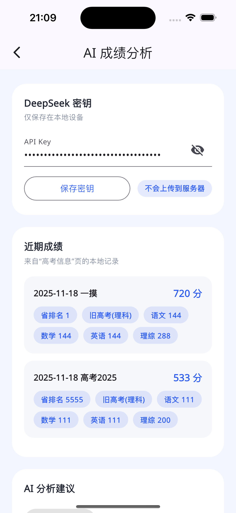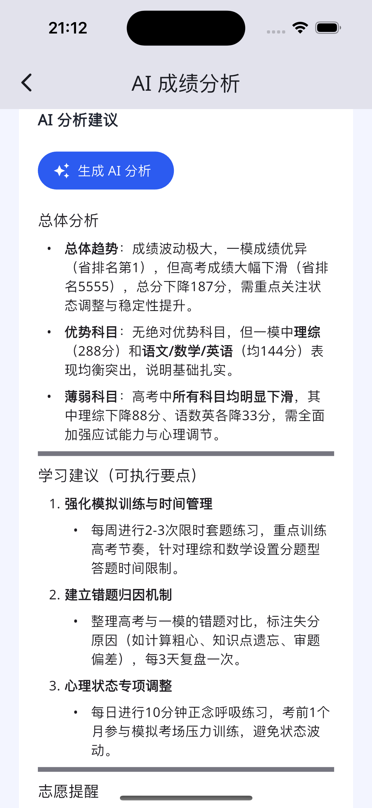

  ---

  ## 5. 交互设计

  ### 5.1 页面切换动画

  #### 底部导航页面切换

  - **动画类型**：AnimatedSwitcher
  - **动画时长**：250ms
  - **切换效果**：淡入淡出 (Fade)
  - **保留状态**：使用 KeyedSubtree 保持页面状态

  #### 页面跳转（Push导航）

  - **进入动画**：从右向左滑入
  - **退出动画**：从左向右滑出
  - **动画时长**：300ms
  - **曲线**：Curves.easeInOut

  ---

  ### 5.2 按钮交互

  #### 浮动操作按钮 (FAB)

  - **点击反馈**：轻微缩放动画
  - **悬停提示**：Tooltip显示
    - 延迟：500ms
    - 位置：按钮上方
    - 偏移：60px
    - 背景：`#1F2430`
    - 文字：白色，14px，加粗

  #### 底部导航按钮

  - **选中动画**：
    - 背景色渐变：透明 → Primary Blue
    - 上移动画：0 → 6px
    - 圆角变化：14px → 16px
    - 阴影出现
    - 图标和文字尺寸增大
  - **动画时长**：200ms
  - **缓动曲线**：Curves.easeOut

  #### 普通按钮

  - **点击反馈**：Material Ripple 效果
  - **禁用状态**：透明度 50%
  - **加载状态**：显示 CircularProgressIndicator

  ---

  ### 5.3 对话框和弹窗

  #### 确认对话框 (AlertDialog)

  - **背景**：白色
  - **圆角**：28px
  - **内边距**：24px
  - **标题**：Title Large, 加粗
  - **内容**：Body Medium
  - **按钮**：文本按钮 + 填充按钮
  - **按钮间距**：8px

  #### 底部弹窗 (ModalBottomSheet)

  - **圆角**：顶部 28px
  - **最小高度**：自适应内容
  - **最大高度**：90% 屏幕高度
  - **背景**：白色
  - **拖拽手柄**：可选
  - **键盘适配**：自动调整位置

  ---

  ### 5.4 表单交互

  #### 输入框焦点状态

  - **未聚焦**：灰色下划线
  - **聚焦**：Primary Blue 下划线加粗
  - **错误状态**：Error Red 下划线和提示文字
  - **Label动画**：浮动动画，字号缩小

  #### 开关控件

  - **样式**：Material Design Adaptive Switch
  - **激活色**：Primary Blue
  - **过渡动画**：流畅的滑动和变色

  ---

  ### 5.5 列表交互

  #### 滚动行为

  - **滚动曲线**：物理引擎模拟
  - **过度滚动**：iOS风格回弹效果
  - **下拉刷新**：可选功能
  - **上拉加载**：分页加载

  #### 列表项点击

  - **点击反馈**：Material Ripple
  - **长按**：可选的上下文菜单

  ---

  ### 5.6 反馈机制

  #### SnackBar 提示

  - **位置**：底部，导航栏上方
  - **背景**：`#1F2430`
  - **文字**：白色，14px
  - **内边距**：16px horizontal, 12px vertical
  - **圆角**：8px
  - **动画**：从底部滑入
  - **持续时间**：2-4秒
  - **行动按钮**：可选

  #### 加载状态

  - **全屏加载**：中心显示 CircularProgressIndicator
  - **局部加载**：在对应区域显示加载器
  - **颜色**：Primary Blue

  ---

  ## 6. 组件库

  ### 6.1 卡片组件 (SectionCard)

  #### 组件属性

  ```dart
  SectionCard(
    title: String,           // 卡片标题
    subtitle: String?,       // 副标题（可选）
    trailing: Widget?,       // 右上角组件（可选）
    child: Widget,           // 卡片内容
  )
  ```

  #### 设计规范

  - **背景**：白色
  - **圆角**：22px
  - **边框**：`#E8ECF4`, 1px
  - **内边距**：20px
  - **标题样式**：Title Large, 加粗, `#1F2430`
  - **副标题样式**：Body Small, `#7C8698`
  - **标题间距**：8px

  ---

  ### 6.2 标签组件 (TagChip)

  #### 组件属性

  ```dart
  TagChip(
    label: String,           // 标签文字
    color: Color?,           // 背景色（可选）
  )
  ```

  #### 设计规范

  - **背景**：浅蓝色 `#EFF3FF` 或自定义颜色 12% 透明度
  - **圆角**：16px
  - **内边距**：horizontal 12px, vertical 6px
  - **文字**：Body Small, 加粗
  - **文字颜色**：对应背景色的深色版本

  #### 应用场景

  - 院校类型标签
  - 推荐类型标签（冲刺/稳妥/保底）
  - 热度变化标签
  - 功能状态标签

  ---

  ### 6.3 时间线组件 (TimelineItem)

  #### 组件属性

  ```dart
  TimelineItem(
    timestamp: String,       // 时间戳
    content: String,         // 内容文字
    variant: TimelineVariant?, // 变体类型（可选）
  )
  
  enum TimelineVariant {
    normal,
    danger,
    warning,
    positive,
  }
  ```

  #### 设计规范

  - **时间戳样式**：Caption, `#7C8698`
  - **内容样式**：Body Medium
  - **指示器**：圆点，根据 variant 改变颜色
    - normal: `#7C8698`
    - danger: Error Red
    - warning: Warning Orange
    - positive: Success Green
  - **连接线**：虚线，`#E8ECF4`

  ---

  ### 6.4 统计卡片组件

  #### 设计规范

  - **背景**：对应功能色 8% 透明度
  - **圆角**：22px
  - **内边距**：18px
  - **标题**：Body Small, 功能色 80% 透明度
  - **数值**：Display Small (34px), 字重 700, 功能色
  - **说明**：Body Small, 功能色 70% 透明度

  #### 应用场景

  - 热度统计卡片
  - 数据概览卡片
  - 成绩统计卡片

  ---

  ## 7. 响应式设计

  ### 7.1 屏幕尺寸适配

  #### 支持的屏幕尺寸

  | 设备类型 | 屏幕宽度  | 适配策略         |
  | -------- | --------- | ---------------- |
  | 小屏手机 | < 360px   | 缩小边距和字号   |
  | 标准手机 | 360-414px | 标准设计         |
  | 大屏手机 | 414-480px | 增加内容宽度     |
  | 平板     | > 480px   | 双列布局（可选） |

  #### 关键断点

  - **小屏断点**：360px
  - **标准断点**：375px（设计基准）
  - **大屏断点**：414px

  ---

  ### 7.2 安全区域适配

  #### SafeArea 处理

  - **顶部**：适配刘海屏和状态栏
  - **底部**：适配Home Indicator，导航栏自动调整高度
  - **底部内容边距**：120px，确保内容不被导航栏遮挡

  ---

  ### 7.3 横屏适配

  #### 横屏布局调整

  - **导航栏**：从底部移到左侧（可选）
  - **内容区**：充分利用宽屏空间
  - **卡片布局**：从单列改为双列或三列

  > 当前版本主要针对竖屏设计，横屏支持为后续优化项。

  ---

  ## 8. 可访问性设计

  ### 8.1 字体大小

  - **最小字号**：11px (Caption)
  - **推荐正文字号**：14px
  - **支持系统字体缩放**：通过 MediaQuery.textScaleFactor

  ### 8.2 颜色对比度

  所有文字和背景的对比度符合 WCAG AA 标准：

  - **正文文字**：对比度 ≥ 4.5:1
  - **大字体标题**：对比度 ≥ 3:1

  ### 8.3 触摸目标

  - **最小触摸区域**：44x44px
  - **按钮最小高度**：48px
  - **导航项最小宽度**：60px

  ### 8.4 语义化

  - **使用 Semantics Widget**：为重要元素添加语义标签
  - **图标配文字**：所有图标按钮都有 Tooltip
  - **表单标签**：输入框都有清晰的 Label

  ---

  ## 9. 技术实现要点

  ### 9.1 状态管理

  - **使用 StatefulWidget**：管理页面级状态
  - **使用 InheritedWidget (AuthScope)**：跨页面共享用户状态
  - **本地持久化**：使用 SharedPreferences 存储用户偏好

  ### 9.2 导航管理

  - **底部导航**：通过索引切换页面，不使用路由栈
  - **页面跳转**：使用 Navigator.push 进行页面跳转
  - **保持状态**：使用 GlobalKey 和 KeyedSubtree

  ### 9.3 动画优化

  - **使用 AnimatedSwitcher**：平滑的页面切换
  - **使用 AnimatedContainer**：流畅的尺寸和颜色变化
  - **使用 AnimatedCrossFade**：内容展开收起动画

  ### 9.4 性能优化

  - **列表优化**：使用 ListView.builder 懒加载
  - **图片缓存**：缓存院校logo和图片
  - **避免过度重建**：合理使用 const 构造函数

  ---

  ## 10. 设计资源

  ### 10.1 设计工具

  - **UI设计**：Figma / Sketch
  - **原型设计**：Figma / Adobe XD
  - **图标库**：Material Icons
  - **颜色工具**：Coolors / Adobe Color

  ### 10.2 设计规范参考

  - **Material Design 3**：https://m3.material.io/
  - **iOS Human Interface Guidelines**：https://developer.apple.com/design/
  - **Flutter Design**：https://docs.flutter.dev/ui/design